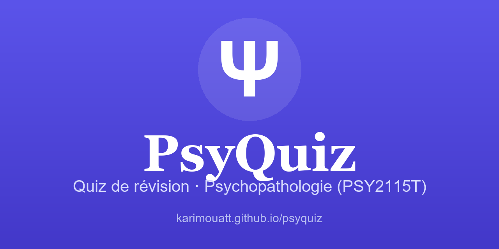

  

  <a href="https://karimouatt.github.io/psyquiz/"><b>▶ Essayer le quiz en ligne</b></a>

---

Quiz de révision interactif pour le cours **Psychopathologie : introduction (PSY2115T)**.

Site statique (HTML / CSS / JS, sans dépendances) — il suffit d'ouvrir `index.html`.

## Chapitres
- Cours 7 — Troubles des conduites alimentaires
- Cours 8 — Schizophrénie
- Cours 9a — Troubles liés à des traumatismes et au stress
- Cours 9b — Troubles liés à l'utilisation d'une substance
- Cours 10 — Troubles de la personnalité

## Fonctionnalités
- **📝 Examen blanc** chronométré (30 questions, correction détaillée à la fin)
- **🎯 Révision ciblée** sur les notions les moins réussies
- **🔀 Quiz mixte** et quiz par chapitre, avec correction immédiate
- Cas cliniques, score, progression et bilan par notion
- Progression sauvegardée localement dans le navigateur (privée à chaque appareil)
- Installable sur iPad / iPhone (« Ajouter à l'écran d'accueil »)

## 📱 Sur iPad / iPhone
1. Ouvrir le lien dans **Safari**
2. Bouton **Partager** → **« Sur l'écran d'accueil »**
3. L'app apparaît avec son icône Ψ, en plein écran

> Les notes de cours d'origine ne sont pas incluses (contenu protégé). Seules les questions de révision le sont.
